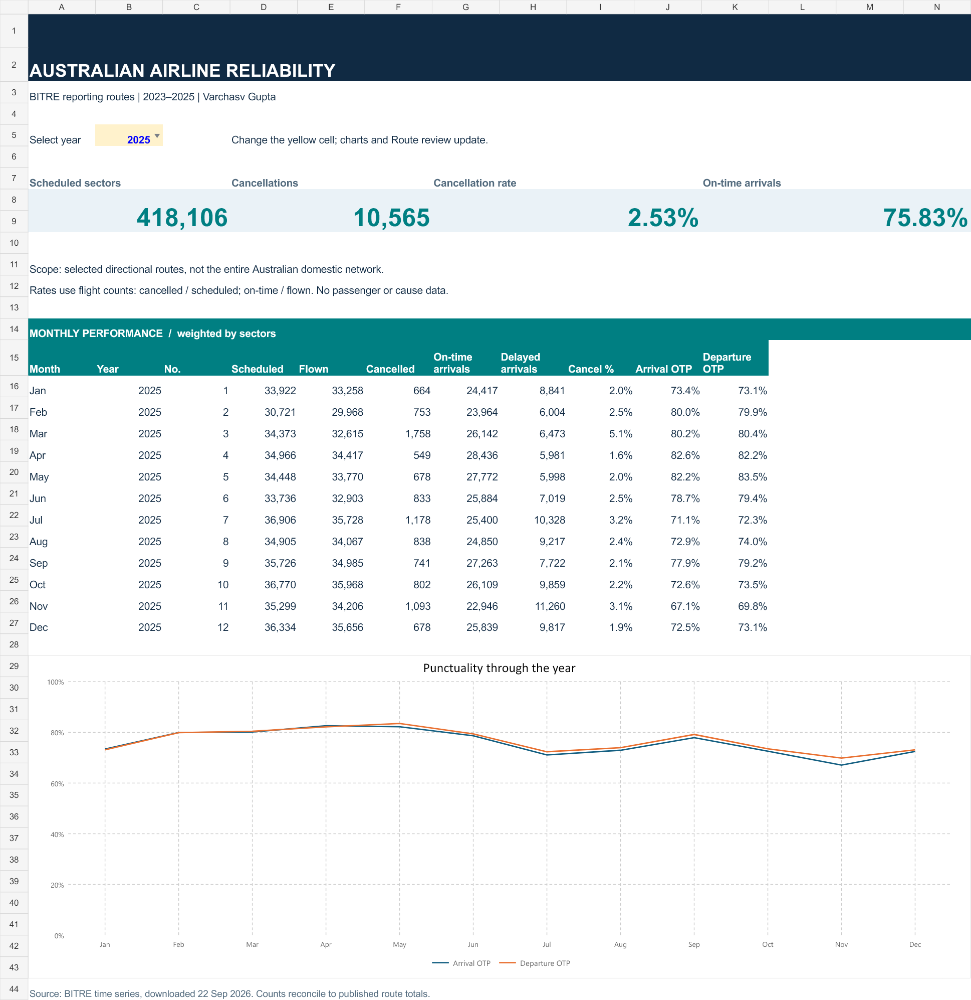

# Australian Airline Reliability

**An end-to-end operations analytics project by Varchasv Gupta.**

Where should an Australian airline operations team investigate unreliable service first? This project combines BITRE's public flight counts with Python data validation, a SQL dimensional model, a portable Power BI report and an interactive Excel workbook. It prioritises investigation using both cancellation volume and cancellation rate, rather than presenting a simplistic airline league table.

**Period:** January 2023–December 2025 · **Grain:** month × airline × directional route · **12,860 records, 128 routes, 7 airlines across the cohort.** Route coverage changes over time.

## Findings that support a decision

| Question | Evidence from SQL | Operational next step |
|---|---|---|
| Where is cancellation volume concentrated? | Sydney–Melbourne and Melbourne–Sydney contributed **2,190 cancellations**, or **20.7%** of the 10,565 cancellations on reporting routes in 2025. | Start a corridor-level review, then obtain flight-level cause codes, aircraft rotations and airport constraints. |
| Is the highest volume route always the highest risk? | Canberra–Sydney recorded **474 cancellations / 7,659 scheduled sectors (6.19%)**, compared with Sydney–Melbourne's **1,103 / 25,294 (4.36%)**. | Review relative frequency alongside volume; do not let a volume-only ranking hide smaller unreliable routes. |
| Did punctuality improve on comparable routes? | Across **116 routes present in all 12 months of both 2024 and 2025**, arrival OTP rose from **73.19% to 75.80% (+2.61 percentage points)**. | Track the same route cohort in recurring reporting; further adjust for airline mix before attributing improvement. |
| Does the route analysis represent the whole industry? | 2025 reporting-route arrival OTP was **75.83%**. The separate entire-network benchmark was **76.9%** (rounded), matching BITRE's annual release. | Keep the two scopes separate in management reporting. |

These are descriptive findings from public data, not evidence of causes, savings, passenger impact or commercial deployment. Recommendations are proposed investigation steps.

## Open the deliverables



- **[Ready-to-open Power BI report (.pbix)](reports/Australian_Airline_Reliability.pbix):** includes the imported data and opens on the 2025 overview. Validated by refreshing in Power BI Desktop and comparing the 2025 KPIs with SQL and Excel.
- **[Excel workbook](reports/Australian_Airline_Reliability.xlsx):** select a year on Dashboard; KPI formulas, the monthly chart and Route review update. Sort/filter the route table. The workbook includes the underlying SQL monthly and route-year outputs.
- **[Power BI project](powerbi/AirlineReliability.pbip):** download/clone this repository, open this file in current Power BI Desktop, then select **Refresh**. Keep both sibling report/model folders. Two report pages support year, airline, origin and route filtering, cross-filtering, a cancellation-volume ranking and a detailed route table.
- **[SQL schema](sql/01_schema.sql)** and **[analysis views](sql/02_analysis_views.sql):** inspect joins, constraints, CTEs, window functions, weighted rates, Pareto share, three-month trends and a fixed-cohort year-on-year comparison.
- **[Curated CSVs and result tables](data/processed):** versioned data used by the model; no database server or source download is needed to reproduce SQL results.
- **[Data audit](data/processed/quality_exceptions.csv)** and **[provenance](data/processed/provenance.json):** source fingerprint, scope counts, normalisation and exception treatment.

## Reproduce the analysis

Python 3.11+ and SQLite 3.25+ (bundled with current Python). From this project directory:

```sh
python -m pip install -r requirements.txt
python src/pipeline.py --from-curated
python src/test_pipeline.py
python src/build_powerbi.py
```

This creates `reports/airline_reliability.sqlite`, regenerates the SQL result CSVs, runs seven acceptance tests and regenerates the Power BI source project. The Power BI model embeds a compressed copy of the curated tables through Power Query M. **Refresh loads that versioned snapshot; it does not download new BITRE data.** This makes the report portable, offline and free of personal file paths or credentials. After changing source data, run the pipeline and generator again before refreshing the report.

For the XLSX, replace the two source tables with regenerated `monthly` and `route_priority` outputs in the documented column order, extend table/formula ranges if the analysis period changes, and recalculate. The supplied workbook's year selector covers 2023–2025. CSV counts are the source of truth; workbook percentages are formulas.

To rebuild from a BITRE workbook:

```sh
python src/pipeline.py --source data/raw/your_bitre_snapshot.xlsx
```

Download from [BITRE's time-series page](https://www.bitre.gov.au/resource/aviation/airline-time-performance-monthly-reports-and-time-series-data). The `LATEST` URL changes over time, so a later download may contain revisions. The analysis was produced from a **22 September 2026** snapshot; its SHA-256 is recorded in provenance. The raw workbook is excluded from Git to avoid repeatedly storing a 10 MB external file. The committed curated data preserves the analysed snapshot. The 2025 annual benchmark assertion deliberately fails if revisions change the published rounded benchmark; investigate and document any change instead of disabling it silently.

## Model and metric contract

`dim_date` (daily, contiguous, 1,096 dates), `dim_airline` and `dim_route` each have one-to-many relationships to `fact_route_month`. `network_month` is a separate fact at month grain, linked only to the date dimension. Direction matters: Sydney–Melbourne and Melbourne–Sydney are separate routes.

| Metric | Calculation | Notes |
|---|---|---|
| Cancellation rate | SUM(cancelled) / SUM(scheduled) | Scheduled sectors are the exposure. |
| Arrival OTP | SUM(arr_on_time) / SUM(flown) | Cancelled flights are excluded from the denominator. |
| Departure OTP | SUM(dep_on_time) / SUM(flown) | Never average row percentages. |
| Arrival change, pp | 100 × (current OTP − prior-year OTP) | Power BI uses the selected scope; SQL matched-cohort view additionally controls route presence. |
| Rolling cancellation rate | Three-month sum(cancelled) / sum(scheduled) | SQL exposes months in the window; initial windows have fewer than three months. |
| Cancellation share | Route cancellations / selected-route cancellations | A concentration measure, not a causal risk score. |

Zero denominators return SQL NULL / DAX BLANK. Excel route rates return a blank when no sectors were scheduled/flown; dashboard months all have positive denominators in this fixed cohort. BITRE defines on-time movements relative to scheduled gate times using a 15-minute threshold; cancellations are flights withdrawn within seven days of departure. Refer to BITRE for the full definitions.

## Data quality: what was checked and what was retained

1. Filtered to three complete calendar years; rejected missing required fields, negative counts and duplicate normalised keys.
2. Standardised **six** `virgin Australia` labels to `Virgin Australia`; no fuzzy airline merging.
3. Split the 17,451 source rows into 12,860 route detail rows, 4,280 route control rows, 275 airline-network totals and 36 industry totals. Totals never enter the route fact table.
4. Reconciled all **29,960 route/month/count checks** against published `All Airlines` route totals: **zero differences**.
5. Checked scheduled = flown + cancelled. Both on-time + delayed partitions also hold for every route fact.
6. Retained a disclosed July 2025 exception outside the route fact: Skytrans Australia's network delayed-arrival and delayed-departure counts each exceed the flown partition by **21**. The same discrepancy propagates to the industry total. The audit therefore contains **four failed checks across two source rows**, not four independent bad flights or four rows. Network OTP uses reported on-time / flown; network delayed counts are never used as a KPI.
7. Validated foreign keys, unique grain, database integrity, period coverage, zero-denominator behaviour, rolling rates, matched-cohort coverage and independently published 2025 network rates.

## Limitations and responsible interpretation

BITRE reporting-route coverage is narrower than the complete domestic network and can change with eligibility and airline participation. Reported routes generally meet BITRE's competitive-route and passenger-volume criteria; missing months are not automatically zero flights. The fixed-route comparison controls presence, but not route frequency, airline mix, schedules, weather or airport disruption. Small denominators can produce unstable rates. Flight counts do not measure passenger volumes or delay duration. No airline affiliation is implied.

## Sources and attribution

Source: **Bureau of Infrastructure and Transport Research Economics (BITRE), Australian Government**, Domestic airline on-time performance time series, downloaded 22 September 2026. This project filters, normalises and analyses the original tabular data. Source data remains subject to the publisher's terms; this repository does not claim ownership of it or reproduce government logos.

- [Monthly reports and time-series data](https://www.bitre.gov.au/resource/aviation/airline-time-performance-monthly-reports-and-time-series-data)
- [Annual reports, including 2025 benchmark](https://www.bitre.gov.au/resource/aviation/airline-time-performance-annual-reports)
- [Microsoft PBIR documentation](https://learn.microsoft.com/en-us/power-bi/developer/projects/projects-report)

**Skills demonstrated:** SQL modelling and validation, Python ETL, Power Query, DAX filter context/time intelligence, Excel SUMIFS and interactive reporting, scope-aware analysis and business communication.
